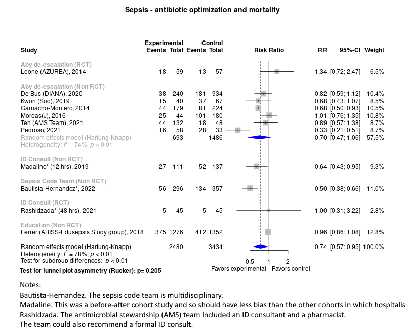

Severe sepsis and septic shock treatment with fluids
============================================
A living systematic review

Short url: http://openmetaanalysis.github.io/sepsis/

**Clinical summary:** This meta-analysis suggests that clinical intervention *is* effective. Heterogeneity of results as measured by I2 was '[substantial](http://handbook-5-1.cochrane.org/chapter_9/9_5_2_identifying_and_measuring_heterogeneity.htm)' at 86%. The heterogeneity may be due to varying levels of patient acuity across studies as reflected in differing levels of mean lactic acid and age in the cohorts. Heterogeneity may also be due to varying cutoffs across studies for defining rapid adminstration of fluids. This review updates previously published meta-analysis(es).

Subgroup analysis suggested a trend that was insignificant.
<!-- * [Reconciliation of conclusions with prior meta-analyses](files/reconciliation-tables/Reconciliation%20of%20conclusions.pdf) (under construction) -->
* [Reconciliation of conclusions with prior meta-analyses](files/reconciliation-tables/Reconciliation%20of%20studies%20and%20conclusions%20-%20fluids%20for%20sepsis.pdf)
<!--* [Keep current with this topic](files/searching/Keep-up.md) (under construction)-->

Acknowledgement: we acknowledge the essential work by the authors of the prior [systematic review(s)](#systematic-reviews) listed below.

**Methods overview:** This repository is an [openMetaAnalysis](https://openmetaanalysis.github.io/) that combines methods of scoping, rapid, and living systematic reviews.  This analysis updates one or more previously published review(s) below. A comparison of studies included in this review compared to prior reviews are in the table, [reconciliation of trials included with prior meta-analyses/](files/reconciliation-tables/Reconciliation%20of%20studies.pdf). Newer studies included are listed in the references below. Rationale for newer trials excluded may be listed at the end of the references. 
* [Methods](http://openmetaanalysis.github.io/methods.html) for openMetaAnalysis
* [Evidence search](files/searching/evidence-search.md) for this review (under construction)

**Results:** Details of the studies included are in the:
<!-- * [Reconciliation of cohorts included with prior meta-analyses/](files/reconciliation-tables/Reconciliation%20of%20studies.pdf) -->
* [Reconciliation of cohorts included with prior meta-analyses](files/reconciliation-tables/Reconciliation%20of%20studies%20and%20conclusions%20-%20fluids%20for%20sepsis.pdf)
* [Description of studies (PICO table)](files/study-details/table-pico.pdf) (under construction)
* [Risk of bias assessment (Clarity)](files/study-details/table-bias.pdf) (under construction)
* [Forest plots](../master/files/forest-plots) ([source data](files/data))
<!-- * [Network plots](../master/files/network) (optional)
* [Reconciliation of conclusions with prior meta-analyses](files/reconciliation-tables/Reconciliation%20of%20conclusions.pdf) (under construction) -->
* [Reconciliation of conclusions with prior meta-analyses](files/reconciliation-tables/Reconciliation%20of%20studies%20and%20conclusions%20-%20fluids%20for%20sepsis.pdf)

The forest plot for the primary outcomes are below. Additional [forest plots](files/forest-plots) of secondary analyses may be available. 

<!--
The meta-regression for the primary outcomes are below. Additional [meta-regressions](files/metaregression) of secondary analyses may be available. 

The GRADE Profile is below. 
-->

References:
----------------------------------

### Systematic review(s)
#### Most recent review at time of last revision of this repository
1. Kalil AC, Johnson DW, Lisco SJ, Sun J. Early Goal-Directed Therapy for Sepsis: A Novel Solution for Discordant Survival Outcomes in Clinical Trials. Crit Care Med. 2017 Apr;45(4):607-614. doi: 10.1097/CCM.0000000000002235. PMID: [28067711](http://pubmed.gov/28067711).
2. Pepper DJ, Jaswal D, Sun J, Welsh J, Natanson C, Eichacker PQ. Evidence Underpinning the Centers for Medicare & Medicaid Services' Severe Sepsis and Septic Shock Management Bundle (SEP-1): A Systematic Review. Ann Intern Med. 2018 Apr 17;168(8):558-568. doi: 10.7326/M17-2947. Epub 2018 Feb 20. Erratum in: Ann Intern Med. 2018 Apr 17;168(8):612. PMID: [29459977](http://pubmed.gov/29459977).
3. Reynolds PM, Wells L, MacLaren R, Scoular SK. Establishing the Therapeutic Index of Fluid Resuscitation in the Septic Patient: A Narrative Review and Meta-Analysis. Pharmacotherapy. 2020 Mar;40(3):256-269. doi: 10.1002/phar.2371. Epub 2020 Feb 18. PMID: [31970818](http://pubmed.gov/31970818).
4. Meyhoff TS, Møller MH, Hjortrup PB, Cronhjort M, Perner A, Wetterslev J. Lower vs Higher Fluid Volumes During Initial Management of Sepsis: A Systematic Review With Meta-Analysis and Trial Sequential Analysis. Chest. 2020 Jun;157(6):1478-1496. doi: 10.1016/j.chest.2019.11.050. Epub 2020 Jan 23. PMID: [3198239](http://pubmed.gov/3198239).
5. Xantus GZ, Allen P, Norman S, Kanizsai PL. Mortality benefit of crystalloids administered in 1-6 hours in septic adults in the ED: systematic review with narrative synthesis. Emerg Med J. 2021 Jun;38(6):430-438. doi: 10.1136/emermed-2020-210298. Epub 2021 Apr 15. PMID: [33858861](http://pubmed.gov/33858861).

### Studies
#### New studie(s) *not* included in the most recent review above
1. Lane DJ, Wunsch H, Saskin R, Cheskes S, Lin S, Morrison LJ, Scales DC. Association Between Early Intravenous Fluids Provided by Paramedics and Subsequent In-Hospital Mortality Among Patients With Sepsis. JAMA Netw Open. 2018 Dec 7;1(8):e185845. doi: 10.1001/jamanetworkopen.2018.5845. Erratum in: JAMA Netw Open. 2019 Jan 4;2(1):e187976. PMID: [30646296](http://pubmed.gov/30646296)
1. Leisman D, Wie B, Doerfler M, Bianculli A, Ward MF, Akerman M, D'Angelo JK, Zemmel D'Amore JA. Association of Fluid Resuscitation Initiation Within 30 Minutes of Severe Sepsis and Septic Shock Recognition With Reduced Mortality and Length of Stay. Ann Emerg Med. 2016 Sep;68(3):298-311. doi: [10.1016/j.annemergmed.2016.02.044](http://dx.doi.org/10.1016/j.annemergmed.2016.02.044). Epub 2016 Apr 14.  PMID: [27085369](http://pubmed.gov/27085369).
1. Leisman DE, Goldman C, Doerfler ME, Masick KD, Dries S, Hamilton E, Narasimhan M, Zaidi G, D'Amore JA, D'Angelo JK. Patterns and Outcomes Associated With Timeliness of Initial Crystalloid Resuscitation in a Prospective Sepsis and Septic Shock Cohort. Crit Care Med. 2017 Oct;45(10):1596-1606. doi: 10.1097/CCM.0000000000002574. PubMed PMID: [28671898](http://pubmed.gov/28671898).
1. Pruinelli L, Westra BL, Yadav P, Hoff A, Steinbach M, Kumar V, Delaney CW, Simon G. Delay Within the 3-Hour Surviving Sepsis Campaign Guideline on Mortality for Patients With Severe Sepsis and Septic Shock. Crit Care Med. 2018 Apr;46(4):500-505. doi: 10.1097/CCM.0000000000002949. PubMed PMID: [29298189](http://pubmed.gov/29298189).
1. Seymour CW, Cooke CR, Heckbert SR, Spertus JA, Callaway CW, Martin-Gill C, Yealy DM, Rea TD, Angus DC. Prehospital intravenous access and fluid resuscitation in severe sepsis: an observational cohort study. Crit Care. 2014 Sep 27;18(5):533. doi: 10.1186/s13054-014-0533-x. PMID: [25260233](http://pubmed.gov/25260233)

#### Trial(s) included in the review above
Not applicable

#### Studie(s) undergoing review
1. Zampieri FG, Machado FR, Biondi RS, Freitas FGR, Veiga VC, Figueiredo RC, Lovato WJ, Amêndola CP, Assunção MSC, Serpa-Neto A, Paranhos JLR, Andrade J, Godoy MMG, Romano E, Dal Pizzol F, Silva EB, Silva MML, Machado MCV, Malbouisson LMS, Manoel ALO, Thompson MM, Figueiredo LM, Soares RM, Miranda TA, de Lima LM, Santucci EV, Corrêa TD, Azevedo LCP, Kellum JA, Damiani LP, Silva NB, Cavalcanti AB; BaSICS investigators and the BRICNet members. Effect of Slower vs Faster Intravenous Fluid Bolus Rates on Mortality in Critically Ill Patients: The BaSICS Randomized Clinical Trial. JAMA. 2021 Sep 7;326(9):830-838. doi: 10.1001/jama.2021.11444. PMID: [34547081](http://pubmed.gov/34547081) *Reports outcome for sepsis subgroups, but only reports by speed of infusion rate and not by speed of initiating fluids*.
2. Maitland K, George EC, Evans JA, Kiguli S, Olupot-Olupot P, Akech SO, Opoka RO, Engoru C, Nyeko R, Mtove G, Reyburn H, Brent B, Nteziyaremye J, Mpoya A, Prevatt N, Dambisya CM, Semakula D, Ddungu A, Okuuny V, Wokulira R, Timbwa M, Otii B, Levin M, Crawley J, Babiker AG, Gibb DM; FEAST trial group. Exploring mechanisms of excess mortality with early fluid resuscitation: insights from the FEAST trial. BMC Med. 2013 Mar 14;11:68. doi: 10.1186/1741-7015-11-68. PMID: [23496872](http://pubmed.gov/23496872).*Does not repot outcome for sepsis subgroups. Pediatrics only*

#### Trial(s) excluded - selected list of important trial(s)
1. Andrews B, Semler MW, Muchemwa L, Kelly P, Lakhi S, Heimburger DC, Mabula C, Bwalya M, Bernard GR. Effect of an Early Resuscitation Protocol on In-hospital Mortality Among Adults With Sepsis and Hypotension: A Randomized Clinical Trial. JAMA. 2017 Oct 3;318(13):1233-1240. doi: 10.1001/jama.2017.10913. PMID: [28973227](http://pubmed.gov/28973227); *did not report outcomes by speed of initiating fluids*.
1. Baghdadi JD, Brook RH, Uslan DZ, Needleman J, Bell DS, Cunningham WE, Wong MD. Association of a Care Bundle for Early Sepsis Management With Mortality Among Patients With Hospital-Onset or Community-Onset Sepsis. JAMA Intern Med. 2020 May 1;180(5):707-716. doi: 10.1001/jamainternmed.2020.0183. PMID: [32250412](http://pubmed.gov/32250412) *Studied 3 hour bundle and not one hour bundle*
1. Hu B, Chen JCY, Dong Y, Frank RD, Passe M, Portner E, Peng Z, Kashani K. Effect of initial infusion rates of fluid resuscitation on outcomes in patients with septic shock: a historical cohort study. Crit Care. 2020 Apr 7;24(1):137. doi: 10.1186/s13054-020-2819-5. PMID: [32264936](http://pubmed.gov/32264936).  *studied rate of fluids within one hour rather than starting of fluids within one hour*
1. Jeong WI, Kim J-S, Yu J, Kang J, Yu G, Cho Y, Jung S, Kim WY, Ryoo SM. The prognostic value of 1-hour bundle completion in septic shock patients. Journal of The Korean Society of Emergency Medicine [Internet]. The Korean Society of Emergency Medicine; 2019 Dec 31 [cited 2021 Sep 8];30(6):537–544. Available from: https://www.jksem.org/journal/view.php?number=2349 *studied completion of fluids within one hour rather than starting of fluids within one hour*
1. Ko BS, Choi SH, Shin TG, Kim K, Jo YH, Ryoo SM, Park YS, Kwon WY, Choi HS, Chung SP, Suh GJ, Kang H, Lim TH, Son D, Kim WY. Impact of 1-Hour Bundle Achievement in Septic Shock. J Clin Med. 2021 Feb 2;10(3):527. doi: 10.3390/jcm10030527. PMID: [33540513](http://pubmed.gov/33540513). *Studied bundle completion among those started on the bundle. Also, did not isolate the role of fluids*
1. Kuttab HI, Lykins JD, Hughes MD, Wroblewski K, Keast EP, Kukoyi O, Kopec JA, Hall S, Ward MA. Evaluation and Predictors of Fluid Resuscitation in Patients With Severe Sepsis and Septic Shock. Crit Care Med. 2019 Nov;47(11):1582-1590. doi: 10.1097/CCM.0000000000003960. PubMed PMID: [31393324](http://pubmed.gov/31393324).
1. Lee SJ, Ramar K, Park JG, Gajic O, Li G, Kashyap R. Increased fluid administration in the first three hours of sepsis resuscitation is associated with reduced mortality: a retrospective cohort study. Chest. 2014 Oct;146(4):908-915. doi: 10.1378/chest.13-2702. PubMed PMID: [24853382](http://pubmed.gov/24853382); PubMed Central PMCID: PMC4188147.
1. Khan RA, Khan NA, Bauer SR, Li M, Duggal A, Wang X, Reddy AJ. Association Between Volume of Fluid Resuscitation and Intubation in High-Risk Patients With Sepsis, Heart Failure, End-Stage Renal Disease, and Cirrhosis. Chest. 2020 Feb;157(2):286-292. doi: 10.1016/j.chest.2019.09.029. Epub 2019 Oct 14. PMID: [31622591](http://pubmed.gov/31622591).  *studied volume of fluids rather than starting of fluids within one hour*
1. Marik PE, Linde-Zwirble WT, Bittner EA, Sahatjian J, Hansell D. Fluid administration in severe sepsis and septic shock, patterns and outcomes: an analysis of a large national database. Intensive Care Med. 2017 May;43(5):625-632. doi: 10.1007/s00134-016-4675-y. Epub 2017 Jan 27. PubMed PMID: [28130687](http://pubmed.gov/28130687). *Did not analyze 30 cc/kg within 3 hours vs slower* 
1. Meyhoff TS, Møller MH, Hjortrup PB, Cronhjort M, Perner A, Wetterslev J. Lower vs Higher Fluid Volumes During Initial Management of Sepsis: A Systematic Review With Meta-Analysis and Trial Sequential Analysis. Chest. 2020 Jun;157(6):1478-1496. doi: 10.1016/j.chest.2019.11.050. Epub 2020 Jan 23. PMID: [31982391](http://pubmed.gov/31982391).  *studied volume of fluids rather than starting of fluids within one hour*
1. Prasad PA, Shea ER, Shiboski S, Sullivan MC, Gonzales R, Shimabukuro D. Relationship Between a Sepsis Intervention Bundle and In-Hospital Mortality Among Hospitalized Patients: A Retrospective Analysis of Real-World Data. Anesth Analg. 2017 Aug;125(2):507-513. doi: 10.1213/ANE.0000000000002085. PubMed PMID: [28514322](http://pubmed.gov/28514322) *Did not define size of bolus that qualifies as compliant. Did not adjust analysis for comorbidity*
1. Seymour CW, Gesten F, Prescott HC, Friedrich ME, Iwashyna TJ, Phillips GS, Lemeshow S, Osborn T, Terry KM, Levy MM. Time to Treatment and Mortality during Mandated Emergency Care for Sepsis. N Engl J Med. 2017 Jun 8;376(23):2235-2244. doi: 10.1056/NEJMoa1703058. Epub 2017 May 21. PMID: [28528569](http://pubmed.gov/28528569) *did not report outcomes by speed of initiating fluids*.

#### Cited by
This repository is cited by:

1. WikiDoc contributors. Pending content page. WikiDoc. Nov 9, 2014. Available at: http://www.wikidoc.org/index.php/This_topic. Accessed November 9, 2014. 

-------------------------------
[Cite and use this content](https://github.com/openMetaAnalysis/openMetaAnalysis.github.io/blob/master/reusing.MD)  - [Edit this page](../../edit/master/README.md) - [License](files/LICENSE.md) - [History](../../commits/master/README.md)  - 
[Issues and comments](../../issues?q=is%3Aboth+is%3Aissue)

